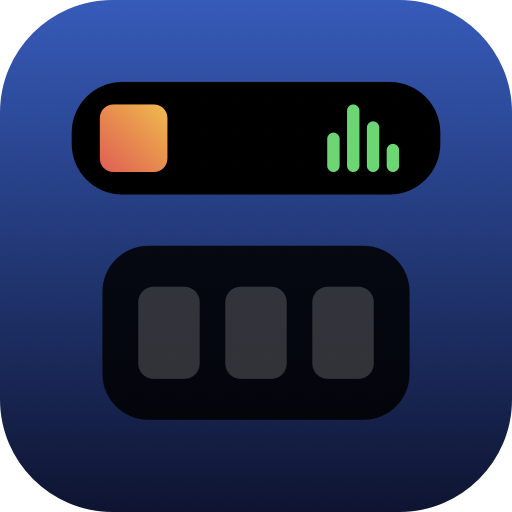

<p align="center">
  
</p>

<h1 align="center">NotchIsland</h1>

<p align="center">
  Turns the MacBook notch into a Dynamic Island. Music, files, live transit, calls, weather, calendar, screenshots and quick notes, all one hover away.<br>
  <b>Created by Adam Brož</b> · macOS 14+ · Swift / SwiftUI · MIT
</p>

<p align="center"><a href="#english">English</a> · <a href="#česky">Česky</a></p>

---

## English

### What it does

Hover over the notch and it expands into a compact black panel. Move away and it folds back. While music plays or you are on a call, small "wings" appear beside the camera, just like the iPhone's Dynamic Island.

| Tab | Features |
|---|---|
| **Island** | Now playing from Spotify or Apple Music with artwork, controls and an equalizer. Calendar strip you can scrub through by dragging (day changes as you drag). Weather tile styled after Apple Weather, based on your location, hover for the hourly forecast. |
| **Tray** | Drop files onto the notch to park them. Drag them back out anywhere, double-click to open. |
| **Transit** | **Stop mode:** live PID (Prague) departures with delays, platform, favorite stops bar, autocomplete, and tracking of a chosen vehicle (last stop, next stop, delay, speed). **Connection mode:** mini search for RegioJet and FlixBus with times, duration, transfers, price, free seats, live RegioJet delay, city autocomplete, favorite routes, "I'm on this one" tracking, ticket links, and a one-click IDOS search for ČD trains. |
| **Calls** | Detects Discord, Zoom, Teams, FaceTime, Slack, Chrome (Meet), Telegram and WhatsApp, and whether the microphone is live. With your own Discord app credentials it shows who is in your voice channel and lets you mute / deafen. |
| **Shot** | Shottr-style screenshots: ⌘⇧2 area, ⌘⇧1 screen, ⌘⇧7 window, ⌘⇧O text recognition (OCR, Czech + English). Every shot is copied to the clipboard and saved to `~/Pictures/NotchIsland`. History with pin-to-screen and an editor (A arrow, R rectangle, O oval, P pen, T text, B blur, C counter, ⌘Z / ⌘⇧Z). |
| **Notes** | A quick notepad that saves itself. |
| **Clipboard** | Clipboard history like Win+V: text, images and files, search, pin, click to copy back. ⌘⇧V opens it. Password-manager entries are skipped. |
| **Settings** | Launch at login, Golemio token (optional, faster PID data), Discord credentials, screenshot folder. |

Languages: Czech, English, German, Slovak, Polish (follows the system language).

### Install

**Download:** grab `NotchIsland-x.y.z.dmg` from Releases, drag the app to Applications, open it. On first launch macOS asks for Screen Recording, Calendar, Location and control of Spotify / Music. Allow them once, they are remembered. The app adds itself to Login Items, so it starts with your Mac (you can turn that off in Settings).

**Build from source** (Xcode 15+ / Swift 5.9+):

```bash
git clone https://github.com/brozovec/NotchIsland.git
cd NotchIsland
./build.sh install      # builds, signs and copies to /Applications
./build.sh dmg          # builds a distributable DMG
```

`build.sh` signs with your "Apple Development" certificate if present, otherwise ad hoc. A stable signature matters: it is what lets macOS remember the permissions between builds.

### Data sources

- PID departures: Golemio API with a free token, or the public GTFS-Realtime feed plus the daily PID GTFS timetable (no key needed).
- RegioJet and FlixBus: the public endpoints their websites use. ČD trains open in IDOS, since ČD publishes no open API.
- Weather: Open-Meteo, location from CoreLocation with an IP-based fallback.
- Discord voice channel: Discord RPC over the local IPC socket. Discord only exposes this to an app you register yourself at discord.com/developers (Client ID + Secret, redirect `http://localhost`).

### Notes

Requires a Mac with a notch for the full effect; on other Macs a small island is drawn below the top edge. Global hotkeys clash with Shottr if it is running, so quit it or change its shortcuts.

---

## Česky

### Co to umí

Najedeš myší na výřez a rozbalí se kompaktní černý panel. Odjedeš a zase se sbalí. Když hraje hudba nebo jsi na hovoru, vedle kamery se objeví "křídla" jako u Dynamic Islandu na iPhonu.

| Záložka | Funkce |
|---|---|
| **Island** | Přehrávaná skladba ze Spotify nebo Apple Music s obalem, ovládáním a equalizerem. Kalendářní pásek, kterým se dá tažením scrubovat (den se mění pod prstem). Dlaždice počasí ve stylu Apple Počasí podle tvé polohy, po najetí hodinová předpověď. |
| **Tray** | Přetáhni soubory na notch a odlož si je. Odtud je zase přetáhneš kamkoli, dvojklik otevře. |
| **Doprava** | **Zastávka:** živé odjezdy PID se zpožděním, nástupištěm, lištou oblíbených zastávek, našeptáváním a sledováním vybraného vozu (poslední a další zastávka, zpoždění, rychlost). **Spojení:** mini vyhledávač RegioJet a FlixBus s časy, délkou, přestupy, cenou, volnými místy, živým zpožděním RegioJetu, našeptáváním měst, oblíbenými trasami, sledováním "sedím v tomhle spoji", odkazy na jízdenky a jedním klikem na IDOS pro vlaky ČD. |
| **Hovory** | Pozná Discord, Zoom, Teams, FaceTime, Slack, Chrome (Meet), Telegram a WhatsApp a jestli je aktivní mikrofon. S vlastní Discord aplikací ukáže, kdo je s tebou v hlasovém kanálu, a umí mute / deafen. |
| **Shot** | Screenshoty ve stylu Shottr: ⌘⇧2 oblast, ⌘⇧1 obrazovka, ⌘⇧7 okno, ⌘⇧O rozpoznání textu (OCR, česky i anglicky). Každý snímek jde do schránky a do `~/Pictures/NotchIsland`. Historie s připnutím na obrazovku a editor (A šipka, R obdélník, O ovál, P pero, T text, B rozmazání, C počítadlo, ⌘Z / ⌘⇧Z). |
| **Poznámky** | Rychlý zápisník, ukládá se sám. |
| **Schránka** | Historie schránky jako Win+V: text, obrázky i soubory, hledání, připnutí, klik zkopíruje zpět. ⌘⇧V ji otevře. Položky ze správců hesel přeskakuje. |
| **Nastavení** | Spouštění po přihlášení, Golemio token (volitelný, rychlejší data PID), Discord přihlášení, složka pro snímky. |

Jazyky: čeština, angličtina, němčina, slovenština, polština (podle jazyka systému).

### Instalace

**Stažení:** vezmi `NotchIsland-x.y.z.dmg` z Releases, přetáhni appku do Aplikací a spusť. Při prvním startu macOS požádá o nahrávání obrazovky, kalendář, polohu a ovládání Spotify / Hudby. Povol to jednou, pamatuje se to. Appka se sama přidá do položek po přihlášení, takže startuje s Macem (v Nastavení jde vypnout).

**Sestavení ze zdrojáků** (Xcode 15+ / Swift 5.9+):

```bash
git clone https://github.com/brozovec/NotchIsland.git
cd NotchIsland
./build.sh install      # sestaví, podepíše a nakopíruje do /Applications
./build.sh dmg          # vytvoří DMG k distribuci
```

`build.sh` podepisuje certifikátem "Apple Development", když ho máš, jinak ad hoc. Stabilní podpis je důležitý, díky němu si macOS pamatuje oprávnění mezi buildy.

### Zdroje dat

- Odjezdy PID: Golemio API s bezplatným tokenem, nebo veřejný GTFS-Realtime feed plus denní jízdní řád PID (bez klíče).
- RegioJet a FlixBus: veřejná rozhraní jejich webů. Vlaky ČD se otvírají v IDOS, ČD otevřené API nemá.
- Počasí: Open-Meteo, poloha z CoreLocation s náhradou podle IP.
- Discord hlasový kanál: Discord RPC přes lokální socket. Discord to zpřístupní jen aplikaci, kterou si sám zaregistruješ na discord.com/developers (Client ID + Secret, redirect `http://localhost`).

### Poznámky

Plný efekt vyžaduje Mac s výřezem; na ostatních se vykreslí malý ostrůvek pod horní hranou. Globální zkratky kolidují se Shottrem, pokud běží, tak ho vypni nebo mu změň zkratky.

---

<p align="center">Made with ❤️ in Prague by <b>Adam Brož</b></p>
